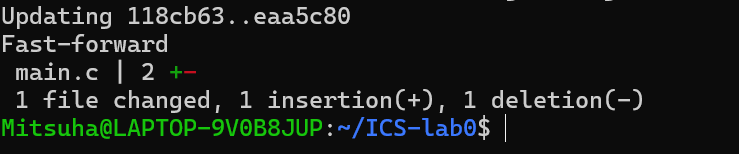
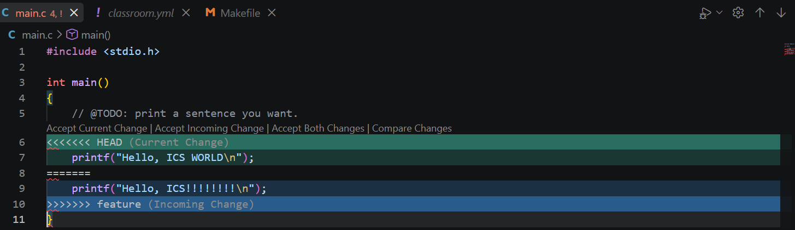
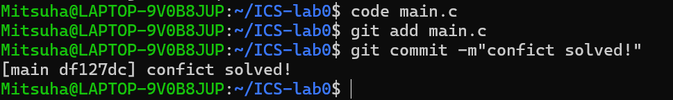

#ICS-Lab0 实验报告

##回答问题：

###对三个问题的回答：

1·Q：你之前有过多人协同开发的经历吗？如果有，你们是使用什么方式分工协作的？

A：之前有过开发的经历，使用的也是github，但是没有使用git，当时没有系统学习过。

2·Q：思考一下，Git 为什么要设计“暂存-提交”两个步骤？

A：暂存和提交的两个步骤可以让开发人的方案不至于丢失，在申请合并时如果需要重新整改文件不会丢失。

3·Q：git branch 和 git branch -a 的区别是什么？查阅资料并回答。

A：git branch 只看本地的分支，git branch -a本地与远程的分支都可以查看。

###对commit message文章的概括：
commit message为commit提交说明给出了一个高效范式，在合作开发时可以高效的互相识别此次commit改动了哪些内容，从而更高效的开发。

###对语义化版本文章的简要概括：
将版本号语义化，能够让开发者不需要看代码就能清楚这次的更新有什么样的改动，从而评估风险，提高工作效率。

###为什么要学习 Git：
我们学习Git，能够与世界的开发者接轨，提高开发效率，在模范化的工作流中提升开发技能。

##实验步骤：
1.我首先按照实验课上的说明，安装了ubuntu，配置了linux环境。

2.我安装了VScode，并配置了wsl环境。

3.我注册了github账户，并且按照课程文件的步骤自己实践了git的语法与操作。

4.我将助教给的模板仓库克隆到了本地，按照要求进行了实验，并进行了截图。

实验过程在不同branch上的commit:

第一次merge未出现conflict:

merge出现conflict:

conflict在main.c中的改动:

conflict解决:
